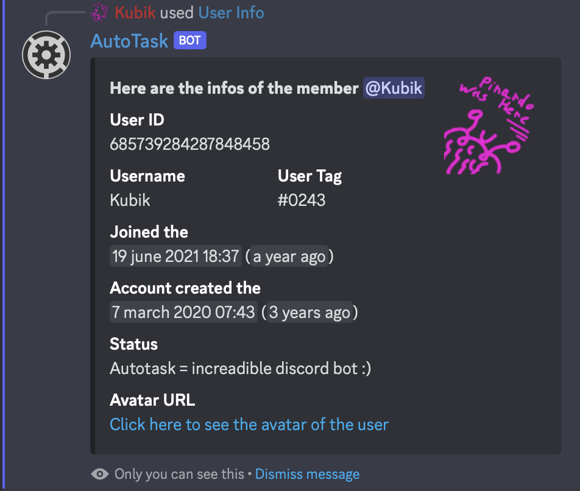

# ℹ User Info

To get a lot of infos about a user, you can click on his profile (on a server where AutoTask is), go in the "Applications" menu and click on "User Info". You will get a result like this:

<figure><figcaption></figcaption></figure>
