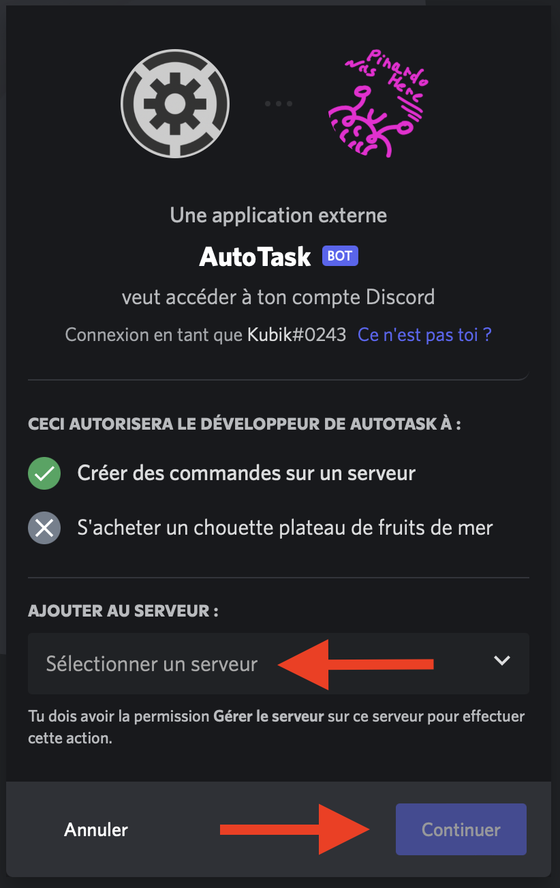

# Installation of the bot

## <mark style="color:purple;">AutoTask invitation</mark>

Let's start by inviting **AutoTask** on your server by going to [<mark style="color:blue;">the invitation page (by clicking here)</mark>](https://discord.com/api/oauth2/authorize?client\_id=1031790327570374686\&permissions=8\&scope=bot%20applications.commands).

<figure><figcaption>
Log in if necessary and choose the server. Then click on "Continue".
</figcaption></figure>


And that's it! **AutoTask** is now on your server and it's ready!


## <mark style="color:purple;">AutoTask installation</mark>

Once **AutoTask** is on your server, he should have the necessary permissions to do what you want it to do.\
Give him the <mark style="color:red;">Administrator</mark> permission in the Roles tab of your Discord server settings to make sure he has permission to do everything.

If you want **AutoTask** to assign roles, make sure they are lower in the server hierarchy. You can change this order by dragging roles up and down.


If you trust AutoTask by letting him <mark style="color:red;">administrator</mark>, you should not encounter any permission problems.\
The primary installation of the bot is finished.Next step, the configuration!

