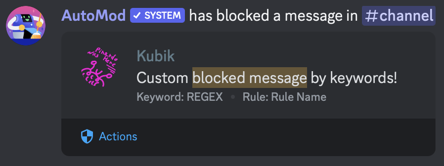

# 🔨 Automod

AutoMod is the **perfect feature** for your server! Discord can block messages, before they are sent!\
AutoTask allows you to give him keywords, and he will create the rule for you!

<figure><figcaption></figcaption></figure>


You can create up to 7 custom rules to block keywords for every server

