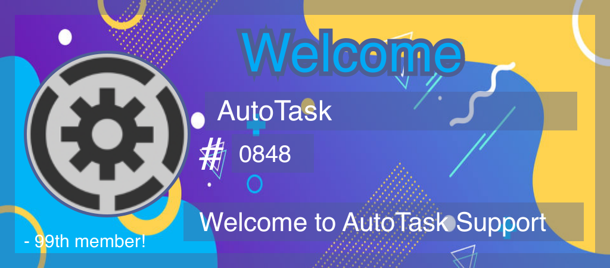
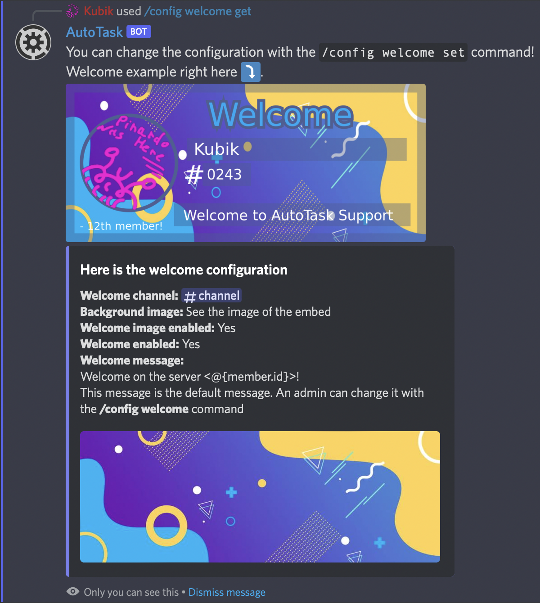

# 👋 Welcome

The welcome module is a nice way to welcome new members on your server! With this nice custom image, the new members are more attracted (only text is annoying...). You can also define welcome roles!

<figure><figcaption></figcaption></figure>

## Get the current welcome config

Type <mark style="color:blue;">/config welcome get</mark> to get the current welcome message, image and what is enabled like below :

<figure><figcaption></figcaption></figure>

You will also get the welcome roles in the embed. (not showed in this screen because this is a new update :))

## Define anything in the welcome config

To define the welcome message, just use the <mark style="color:blue;">/config welcome set\_msg</mark> command, then click on the button and type the welcome message in the FIRST field. The second field is only to help you with variables and to use as a draft.

To set something else like the welcome channel, or if it's enabled or not, use the <mark style="color:blue;">/config welcome set</mark> and enter the values that you want to change. For example:

<mark style="color:blue;">/config welcome set channel:#new-channel</mark> to only change the channel\
<mark style="color:blue;">/config welcome set channel:#new-channel img\_enabled:False</mark> if you want to change the channel and if the image is sended!

## Set the welcome roles

To add or remove welcome roles, you can use the <mark style="color:blue;">/config welcome autorole</mark> command and set the <mark style="color:blue;">action</mark> parameter to <mark style="color:blue;">Add</mark> if you want to add or <mark style="color:blue;">Remove</mark> if you want to remove.\
The bot will then ask you for the role to add or remove. You have 30 seconds to ping the role to add/remove to the autoroles.\
And you are done!
