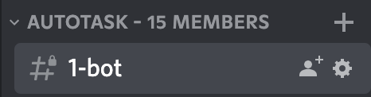
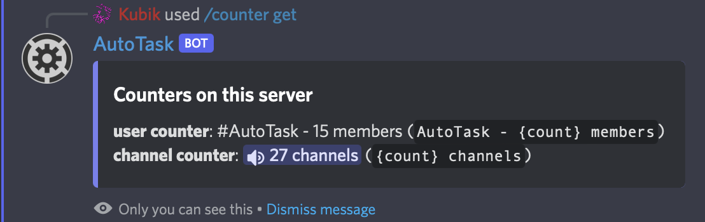

# 📊 Counters

Counters are a way to let your members know how many bots/channels/roles (or more) are on your server. This is faster than count manually :)

<figure><figcaption></figcaption></figure>

## Get all counters

To get all the counters on your server, you can use the <mark style="color:blue;">/counter get</mark> command. This gives you a result like this (but with your counters):

<figure><figcaption></figcaption></figure>

## Create a counter


You have a limit of 5 counters with the free plan. (Enough to have a counter for each category)


To create a counter, you need 3 variables.\
First, the channel. The channel is an existing channel that will be the counter and it's updated every 10 minute (to avoid ratelimit).\
\
Then, the format. The format is what is the name of the channel. For example if you want "XX members !!" the format will be "{count} members !!". {count} is a variable that is replaced by the real count.\
\
The last argument is the type. Here is all the types:\
**Member count**: It will count the number of bots AND users.\
**User count**: Only the humans.\
**Bot count**: Only the bots.\
**Channel count**: The number of channels (voice channels, text, forums, categories).\
**Role count**: The number of roles.\
\
Now, you know every variable. Replace the _italic_ parameters with the variables and done!\
<mark style="color:blue;">/counter create</mark> <mark style="color:blue;"></mark>_<mark style="color:blue;">channel</mark>_ <mark style="color:blue;"></mark><mark style="color:blue;"></mark> <mark style="color:blue;"></mark>_<mark style="color:blue;">format</mark>_ <mark style="color:blue;"></mark><mark style="color:blue;"></mark> <mark style="color:blue;"></mark>_<mark style="color:blue;">count</mark>_

## Delete a counter

To delete a counter, you have two methods.\
First, (the not very good one): delete the counter channel.\
Second (better way!!): Use the delete command.\
\
To remove a counter, use this command: <mark style="color:blue;">/counter remove</mark> where _<mark style="color:blue;">channel</mark>_ is the counter channel. Then, you can delete the counter channel if you want.
