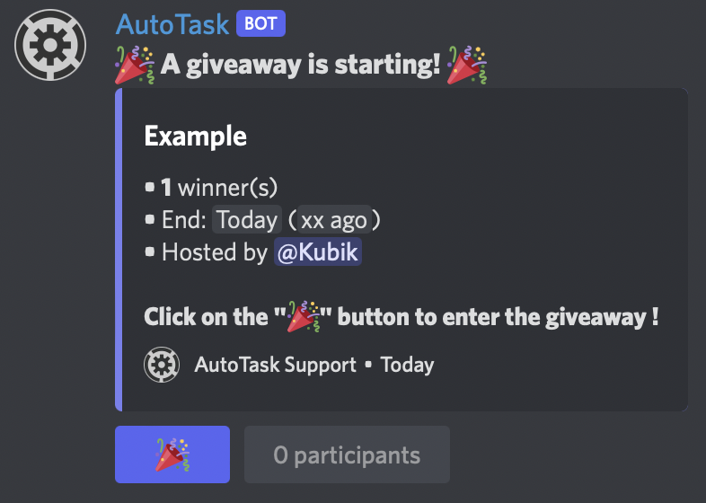

# 🎉 Giveaways

Giveaways are the best way to reward your community! Offer gifts to your members while being sure they have a particular role for example!

<figure><figcaption></figcaption></figure>

## Create a giveaway

To create a giveaway, simply use the command below (every argument in _<mark style="color:blue;">blue and italic</mark>_ is followed by his description):\
<mark style="color:blue;">/giveaway create</mark>\
_<mark style="color:blue;">prize</mark>_ What do you want to give to the winner(s)?\
_<mark style="color:blue;">winners</mark>_ How many winners?\
_<mark style="color:blue;">time</mark>_ How long is the giveaway? **PLEASE WRITE IN MINUTES** (from 0.1 minute to 25000 minutes (a bit more that 2 weeks))\
_<mark style="color:blue;">(channel)</mark>_ The channel of the giveaway. Not given = in the channel where the command has been used.\
_<mark style="color:blue;">(host)</mark>_ Who host the giveaway? Default = you\
_<mark style="color:blue;">(ping)</mark>_ Do you want the bot to ping any role? If not you can send a ping mannualy or just don't ping.\
_<mark style="color:blue;">(required\_roles)</mark>_ All the roles that a user MUST have to enter in the giveaway. Write it like that: \
<mark style="color:orange;"><@\&role1> <@\&role2></mark> with one, two or more required roles! (ping the role and separated them by a space)\
_<mark style="color:blue;">(bonus\_roles)</mark>_ All the roles that are not needed to enter but if a member have it, he will enter multiple times in the giveaway (more chances to win). Format it like that:\
<mark style="color:orange;"><@\&role1></mark> <mark style="color:orange;"></mark>_<mark style="color:orange;">1</mark>_ <mark style="color:orange;"></mark><mark style="color:orange;"><@\&role2></mark> <mark style="color:orange;"></mark>_<mark style="color:orange;">3</mark>_ so you ping the role, space and the number of bonus entries that the role gives. You can repeat the process for more bonus roles.\
_<mark style="color:blue;">(multiple\_win)</mark>_ Can a single user win multiple times? (possible with the bonus roles) Default is false.\
\
A lot of arguments :)

## List all the giveaways


This will only give you the giveaways that are not finished!


This command is very simple and only has 2 optionnal arguments.\
To list all giveaways you can use this command: <mark style="color:blue;">/giveaway list</mark>\
\
But if you want for example only the giveaways of a certain channel, the command is: <mark style="color:blue;">/giveaway list</mark> <mark style="color:blue;"></mark>_<mark style="color:blue;">channel</mark>_ where the channel is a channel of your server.\
\
If you want only giveaways with a specific host, use the <mark style="color:blue;">/giveaway list</mark> <mark style="color:blue;"></mark>_<mark style="color:blue;">host</mark>_ command.\
\
You can do both, channel and host, with this command: <mark style="color:blue;">/giveaway list</mark> <mark style="color:blue;"></mark>_<mark style="color:blue;">channel</mark>_ _<mark style="color:blue;">host</mark>_.

## End a giveaway

To end a giveaway, you will need the giveaway message ID. If you don't know how to get a message ID, [<mark style="color:blue;">click here</mark>](../other/get-any-id.md). And also, do you want that the giveaway end with or without winners?\
\
To end a giveaway, use this command <mark style="color:blue;">/giveaway end</mark> <mark style="color:blue;"></mark>_<mark style="color:blue;">message\_id winners</mark>_ where the messageID is the copied one and winners is on True if you want winners to be chosen.
