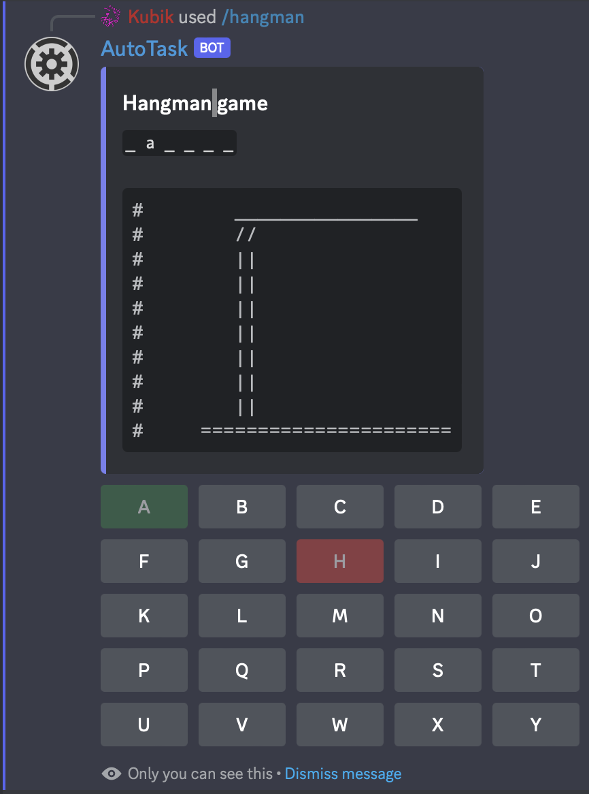

# 🪢 Hangman

With AutoTask, you can also play to the Hangman game on Discord!\
Create a game by using the <mark style="color:blue;">/hangman</mark> command and precise in what language the secret word must be.\
You can then click on the buttons for the letters! A correct letter will change the button color into <mark style="color:green;">green</mark> and a invalid in <mark style="color:red;">red</mark>.


**Tip**: to "save" the game of make it visible for ever, you can use the command in my DM's


<figure><figcaption></figcaption></figure>
