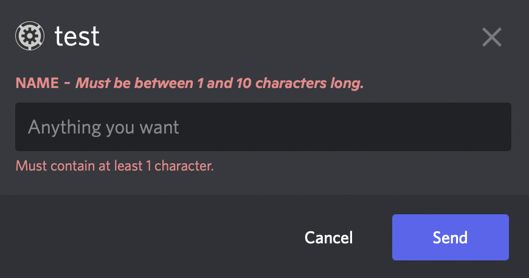
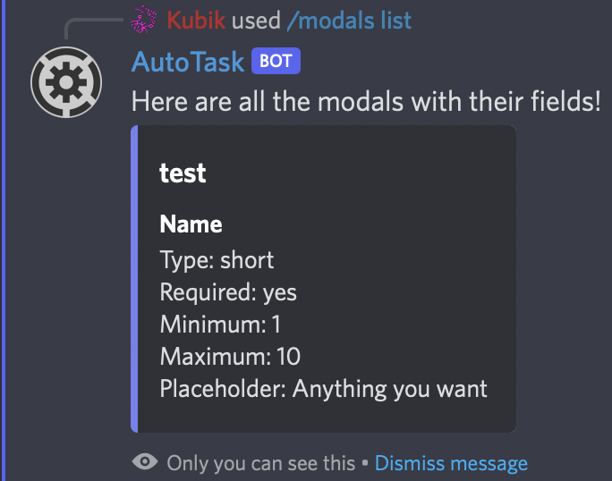

# 📝 Modals

Custom modals are super cool to ask your community questions, where only the moderators can see the answers. The advantage is : it's on Discord! So you define a "output" channel where the answers are sent, and you decide the channel permissions!

<figure><figcaption></figcaption></figure>

## Create or delete a modal

The first step to have cool modals on your server, is to create one. To do so, run the <mark style="color:blue;">/modals create</mark> command and enter a name for the modal (unique name!) and a "output" channel where the answers would be sent.\
Now, you have your modal!\
\
To delete a modal, juste use the <mark style="color:blue;">/modals delete</mark> command and precise the name of the modal to delete.


Once deleted, a modal is **deleted**, no way to get it back!


## List all the modals

You forgot a modal name? Or you want to know how many modals do you have on your server?\
Use the <mark style="color:blue;">/modals list</mark> command and you will have something like that:

<figure><figcaption></figcaption></figure>

But if you want only the infos of one modal, you can use the <mark style="color:blue;">/modals info</mark> command and precise the name of the modal that you want.

## Send your modal

To allow users to open the modal and to fill it, the bot will send a message with a button that, once clicked, will open the modal to the member that clicked on the button. To make the bot send this message, use <mark style="color:blue;">/modals send</mark> and enter the name of the modal to send and the content of the message that the bot will send.

## Edit a modal

### Change the name

If you just want to change the name of a modal, first make sure that the new name is not an existing modal on your server and then, you can use <mark style="color:blue;">/modals edit name</mark> and fill out name with the current _<mark style="color:blue;">name</mark>_ and _<mark style="color:blue;">newname</mark>_ with the new name.

### Remove a field

To remove a field of a modal, it's very simple.\
Use the <mark style="color:blue;">/modals info</mark> (precise the name of the modal) and find the number of the field you want to delete.\
Then just run <mark style="color:blue;">/modals edit field-remove</mark> where _<mark style="color:blue;">name</mark>_ is the modal name and _<mark style="color:blue;">number</mark>_ the number in the <mark style="color:blue;">/modals info</mark> command.

### Add a field

This is probably the command with the most arguments of this page!\
To add a field in a modal, use the command below where every argument in _<mark style="color:blue;">blue and italic</mark>_ is followed by his description:\
<mark style="color:blue;">/modals edit field-add</mark>\
_<mark style="color:blue;">name</mark>_ The name of the modal\
_<mark style="color:blue;">fname</mark>_ The name of the field to add\
_<mark style="color:blue;">type</mark>_ The type of the field (short / long)\
_<mark style="color:blue;">required</mark>_ Is the field required?\
_<mark style="color:blue;">placeholder</mark>_ A text that is in the box (it is the "anything you want" in the top image)\
_<mark style="color:blue;">min</mark>_ The minimum length of the answer for this field\
_<mark style="color:blue;">max</mark>_ The maximum length of the answer for this field


If you understood everything, I am proud of you!\
If not, no problem, you can read again or ask on our Discord for a better explaination.

