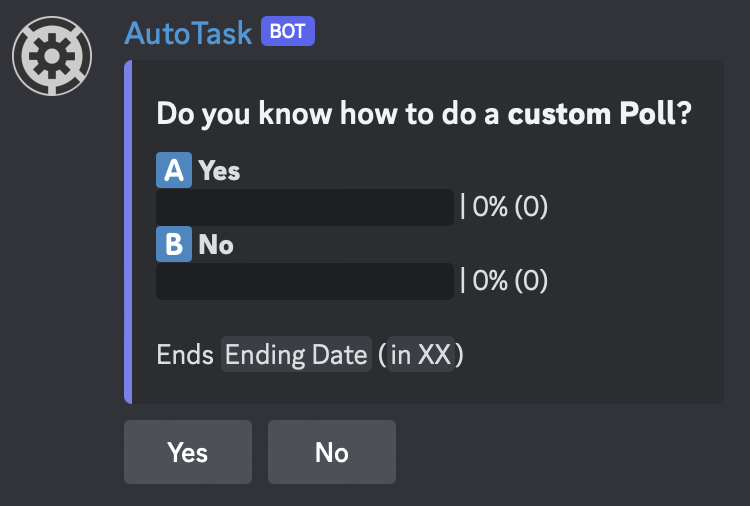

# 📊 Poll

To evolve your server you could do some polls for your community.&#x20;

<figure><figcaption></figcaption></figure>

## How to create a poll

For create a poll you juste have to use <mark style="color:blue;">/poll create</mark>. But you have to fill 4 options because they are obligatory.

### Required fields

There are _<mark style="color:blue;">question</mark>_, _<mark style="color:blue;">choices</mark>_, _<mark style="color:blue;">results</mark>_ and _<mark style="color:blue;">time</mark>_. In the option "question" you to have to  \
\
\- _<mark style="color:blue;">Question</mark>_ : Write the question that will be asked to your community.\
\- _<mark style="color:blue;">Choices</mark>_ : Put the different decision at the question. You must split the different choices with "; " (don't forget the space!)\
\- _<mark style="color:blue;">Results</mark>_ : You have just to put <mark style="color:blue;">True</mark> or <mark style="color:blue;">False</mark>. If you put <mark style="color:blue;">True</mark>, people can see the actual results. But if you choose <mark style="color:blue;">False</mark> nobody can see the results until the end of the poll.\
\- _<mark style="color:blue;">Time</mark>_ : You have to put the duration of the poll. There is a format to respect: days, hours, minutes. For example "2d6h8m". d --> days, h --> hours and m --> minutes. The max is 7days.


Now you know the different required fields but there are other options, for more advanced polls!


### Not required fields

If you want to upgrade your poll you can use other fields. There are _<mark style="color:blue;">description</mark>_, _<mark style="color:blue;">single</mark>_, _<mark style="color:blue;">channel</mark>_ and _<mark style="color:blue;">req\_role</mark>_.\
\
\- _<mark style="color:blue;">Description</mark>_ : It's to give a detailed description for the poll.\
\- _<mark style="color:blue;">Multiple</mark>_ : You have to put <mark style="color:blue;">True</mark> or <mark style="color:blue;">False</mark>. If you choose <mark style="color:blue;">True</mark> people can take only one decision. If you choose <mark style="color:blue;">False</mark> people can choice several decisions (<mark style="color:blue;">False</mark> is by default when you don't use _<mark style="color:blue;">Single</mark>_ option)\
\- _<mark style="color:blue;">Channel</mark>_ : Choose any channel of your server where the poll will be sent!\
\- _<mark style="color:blue;">Req\_role</mark>_ : Choose one role that everyone NEEDS to have to choose any answer to the poll.
