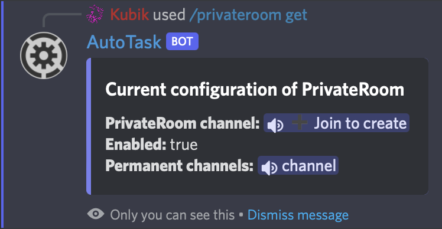

# 🔊 Private rooms

Create a private room lobby to avoid creating a ton of vocal channels. Let the bot create channels when your members need it!

<figure><figcaption></figcaption></figure>

## Private room config

To view the current configuration of the private room, you can use the <mark style="color:blue;">/privateroom get</mark> command. You will get a result like this:

<figure><figcaption></figcaption></figure>

## Change settings

You can edit the settings of the PrivateRooms with two commands. One change the lobby channel, the other if the module is enabled or not.\
To set the lobby channel, use <mark style="color:blue;">/privateroom setchannel</mark> and provide an existing channel to be the lobby channel.\
To enable or disable the module, you can run the <mark style="color:blue;">/privateroom setenabled</mark> command and provide true or false for if it is enabled or not.

## Permanent channels

Permanent channels are channels that are not deleted when there are empty (the lobby channel doesn't count).

### Add

To add permanent channels, use the <mark style="color:blue;">/privateroom permanent add</mark> command and precise what channel is a permanent one.

### Remove

To remove a permanent channel just use <mark style="color:blue;">/privateroom permanent remove</mark> and provide also what channel is not a permanent anymore.


You can see all the permanent channels in the <mark style="color:blue;">/privateroom get</mark> command.


### Reset

To remove all the permanent channels at once, you can use the <mark style="color:blue;">/privateroom permanent reset</mark> <mark style="color:blue;"></mark>_<mark style="color:blue;">confirmation</mark>_ where the confirmation is True.
