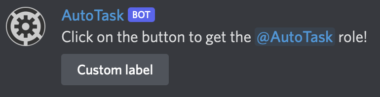

# 🔥 Reaction role

Reaction role is really the best thing for your members to get custom roles like pronoums, favourite color or what every you want!

<figure><figcaption></figcaption></figure>

## Create

I am sure that if you are on this page, you want to know how to create a reaction role!\
To do that, just use the <mark style="color:blue;">/reactionrole create</mark> command where:\
_<mark style="color:blue;">message</mark>_ is the message that the bot will send\
_<mark style="color:blue;">label</mark>_ is the text on the buton\
_<mark style="color:blue;">role</mark>_ is the role given (or removed or toggled) by the reaction role\
_<mark style="color:blue;">type</mark>_ is the type of the reaction role. Types are Add (just add the role), Remove (just remove the role) and Toggle (toggle if the user has or not the role)\
\
And that's it! You have you reaction role!


Multiple buttons one the same message is currently not available. But soon, who knows? :)


