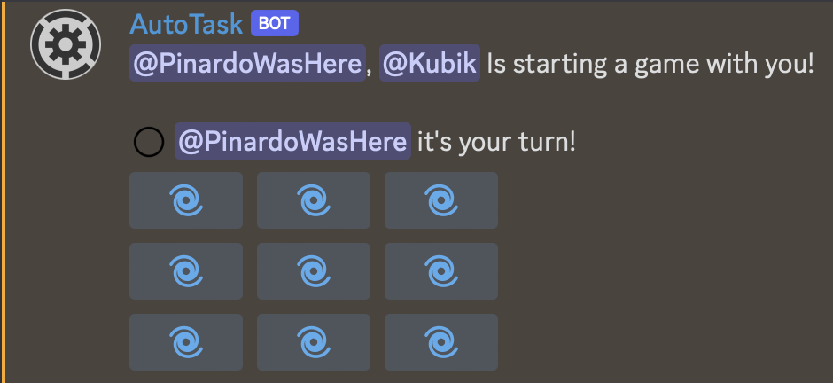

# ⭕ Tic Tac Toe

To play the Tic Tac Toe game on Discord with a someone, just use <mark style="color:blue;">/tictactoe user</mark> where user is the second player.\
Both players are pinged in a message with the game in buttons. Click on a button to place the circle or the cross depending on your symbol.\
A new game look like this:

<figure><figcaption></figcaption></figure>
