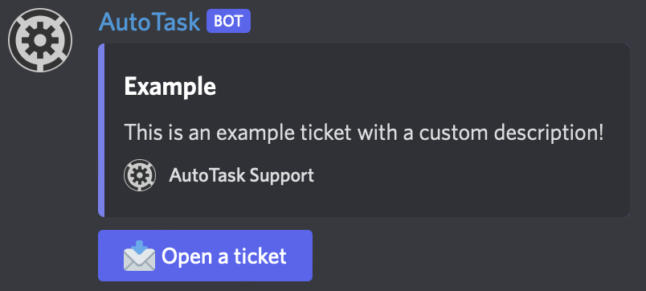

# 📥 Tickets

Tickets are the best way to allow members contact staff on a specific server. It will create a private channel where only the member and the staff have access.

<figure><figcaption></figcaption></figure>

## Create a ticket

To create a ticket, go to the channel where you want the ticket to be created and run this command: <mark style="color:blue;">/tickets create</mark> and precise _<mark style="color:blue;">name</mark>_ for the name of the ticket and description for the _<mark style="color:blue;">description</mark>_ of the ticket. You can also provide the _<mark style="color:blue;">category</mark>_ to have the tickets created in the same category.
